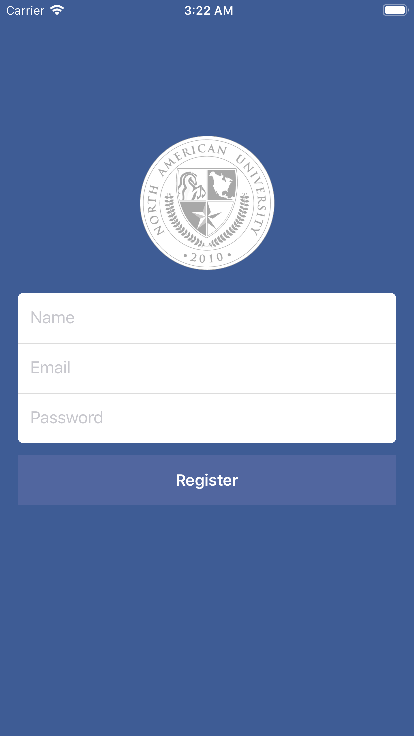

# Bulletin-NAU
------
Messenger application for North American University. An easier and faster way of reaching out to your faculty to resolve problems, spread the word, share new ideas, and much more! When students and faculty is in constant touch, university becomes a group of people working together towards a single goal, success.

*Meeting are lame. Emails are slow. Mail is slower. Messaging is instant.*

**Contents**

- Demo
- Documentation
- About us

